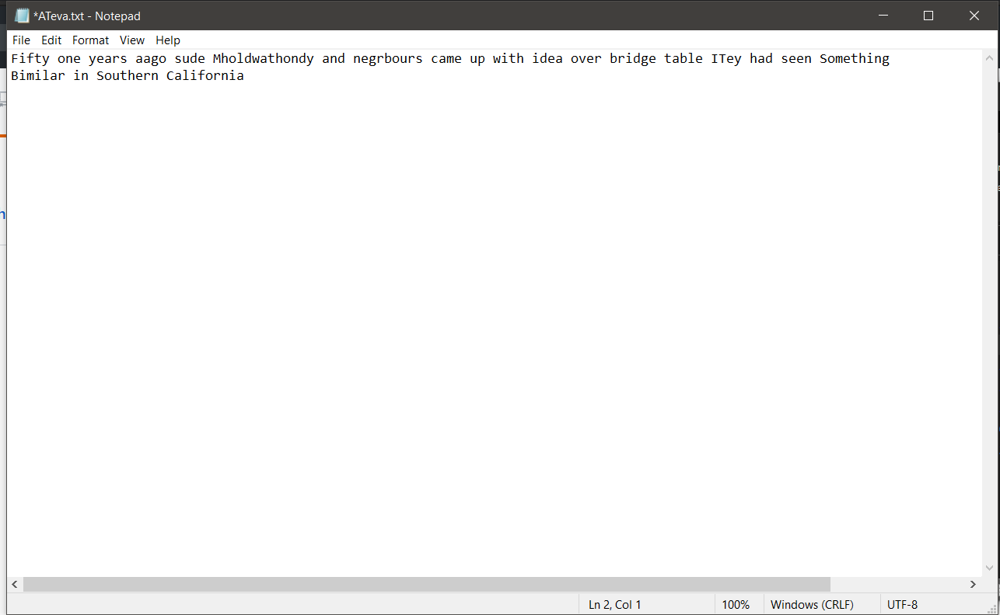
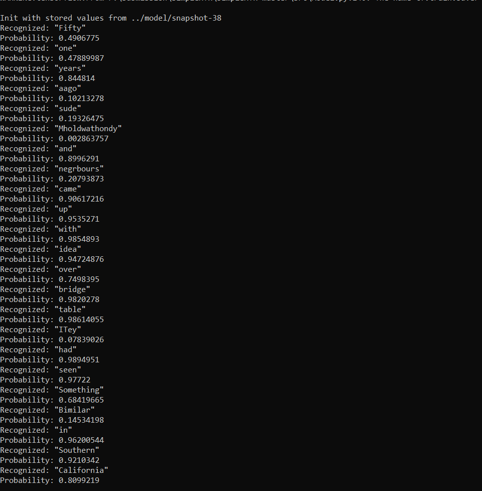

# Handwritten_text_recognition

Handwritten Text Recognition (HTR) system implemented with TensorFlow (TF) and trained on the IAM off-line HTR dataset.
This Neural Network (NN) model recognizes the text contained in the images of segmented words as shown in the illustration below.
As these word-images are smaller than images of complete text-lines, the NN can be kept small and training on the CPU is feasible.

<pre>Sentences in document are converted to words using word_segmentation</pre>

###accuracy

74% of the words from the IAM dataset are correctly recognized by the NN when using vanilla beam search decoding.

<h1>Steps</h1>

1)Go to the wordsegmentaion/src/ directory and main.py. Take care that the image files are placed directly into the wordsegmentaion/data/d2 and not some subdirectory. Afterwards, go to the src/ directory and run python main.py. The input image and the  output will be placed in the wordsegmentaion/out/.

2)Place the segmented images into the test/ folder and open src/ateva_main1.py and run with python. This analyses the images placed in the test folder and processed with neural network ,output written into Ateva.txt file.

<pre>py ateva_main1.py
2020-04-11 16:41:36.624436: I tensorflow/stream_executor/platform/default/dso_loader.cc:44] Successfully opened dynamic library cudart64_100.dll
Validation character error rate of saved model: 10.624916%

Use keras.layers.BatchNormalization instead.  In particular, `tf.control_dependencies(tf.GraphKeys.UPDATE_OPS)` should not be used (consult the `tf.keras.layers.batch_normalization` documentation).
WARNING:tensorflow:From D:\New folder\lib\site-packages\tensorflow_core\python\layers\normalization.py:327: Layer.apply (from tensorflow.python.keras.engine.base_layer) is deprecated and will be removed in a future version.

WARNING:tensorflow:From D:\New folder\lib\site-packages\tensorflow_core\python\training\rmsprop.py:119: calling Ones.__init__ (from tensorflow.python.ops.init_ops) with dtype is deprecated and will be removed in a future version.
Instructions for updating:
Call initializer instance with the dtype argument instead of passing it to the constructor
Python: 3.7.4 (tags/v3.7.4:e09359112e, Jul  8 2019, 20:34:20) [MSC v.1916 64 bit (AMD64)]
Tensorflow: 1.15.0

Init with stored values from ../model/snapshot-38
Recognized: "Fifty"
Probability: 0.4906775
Recognized: "one"
Probability: 0.47889987
Recognized: "years"
Probability: 0.844814
Recognized: "aago"
Probability: 0.10213278
Recognized: "sude"
Probability: 0.19326475
Recognized: "Mholdwathondy"
Probability: 0.002863757
Recognized: "and"
Probability: 0.8996291
Recognized: "negrbours"
Probability: 0.20793873
Recognized: "came"
Probability: 0.90617216
Recognized: "up"
Probability: 0.9535271
Recognized: "with"
Probability: 0.9854893
Recognized: "idea"
Probability: 0.94724876
Recognized: "over"
Probability: 0.7498395
Recognized: "bridge"
Probability: 0.9820278
Recognized: "table"
Probability: 0.98614055
Recognized: "ITey"
Probability: 0.07839026
Recognized: "had"
Probability: 0.9894951
Recognized: "seen"
Probability: 0.97722
Recognized: "Something"
Probability: 0.68419665
Recognized: "Bimilar"
Probability: 0.14534198
Recognized: "in"
Probability: 0.96200544
Recognized: "Southern"
Probability: 0.9210342
Recognized: "California"
Probability: 0.8099219
</pre>
3) In order to train the model use src/main.py and run with python main.py --train, these trained weights will be stored to the model/
<b>TRAINING:</b>
<pre>
 python main.py --train
Init with new values
Epoch: 1
Train NN
Batch: 1 / 500 Loss: 130.354
Batch: 2 / 500 Loss: 66.6619
Batch: 3 / 500 Loss: 36.0154
Batch: 4 / 500 Loss: 24.5898
Batch: 5 / 500 Loss: 20.1845
Batch: 6 / 500 Loss: 19.2857
Batch: 7 / 500 Loss: 18.3493
...

Validate NN
Batch: 1 / 115
Ground truth -> Recognized
[OK] "," -> ","
[ERR:1] "Di" -> "D"
[OK] "," -> ","
[OK] """ -> """
[OK] "he" -> "he"
[OK] "told" -> "told"
[ERR:2] "her" -> "nor"
...
Character error rate: 13.956289%. Word accuracy: 67.721739%.
</pre>
<b>OUTPUT:</b>

<b> 2) ateva_main.py </b>

